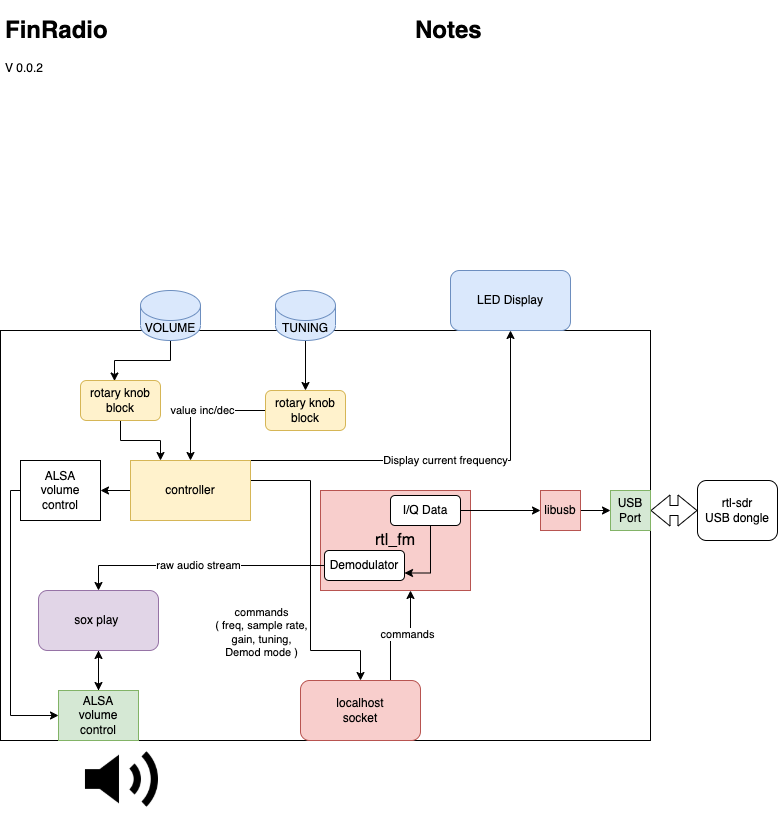
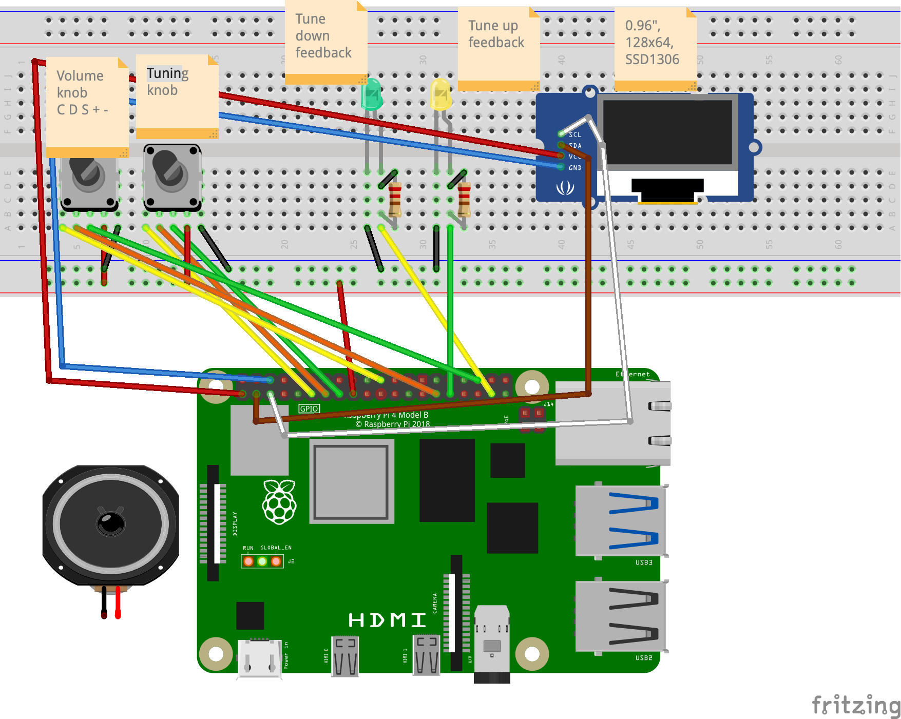
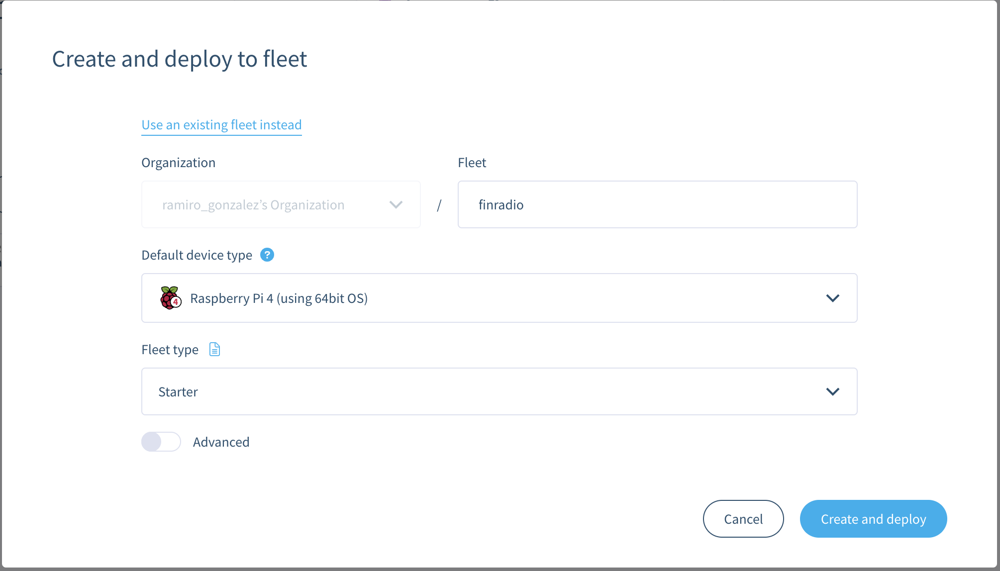
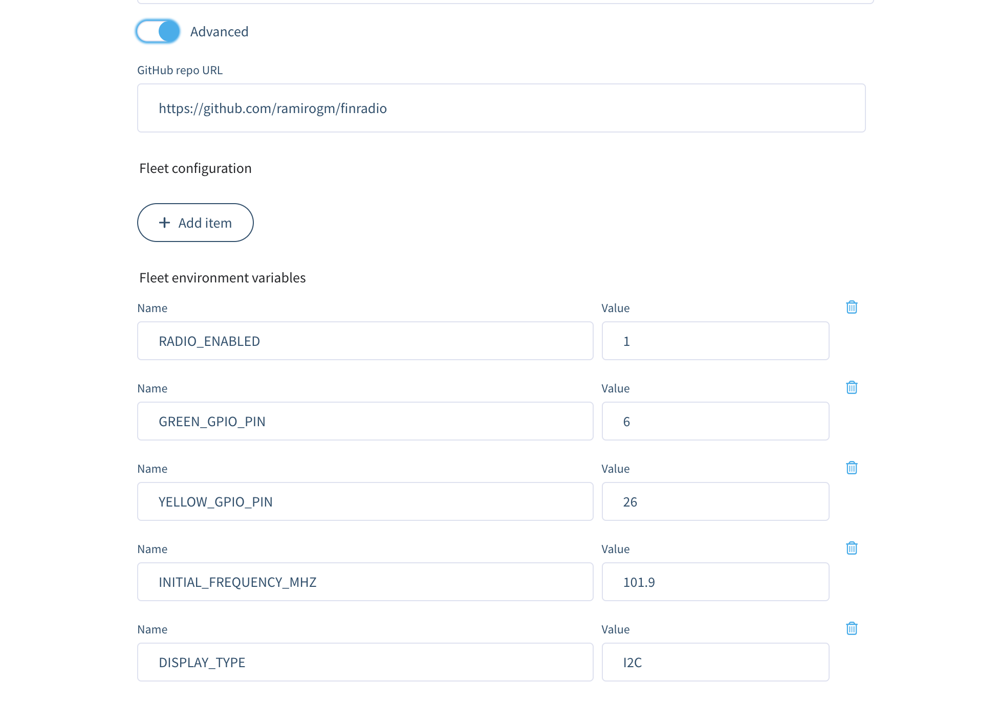
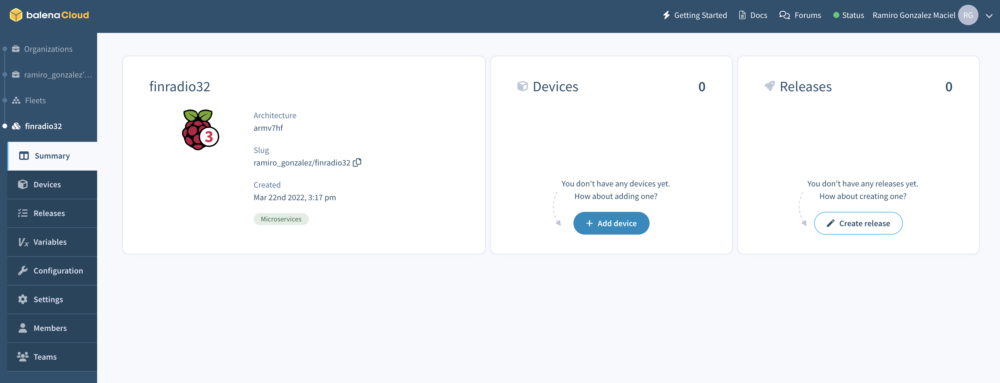
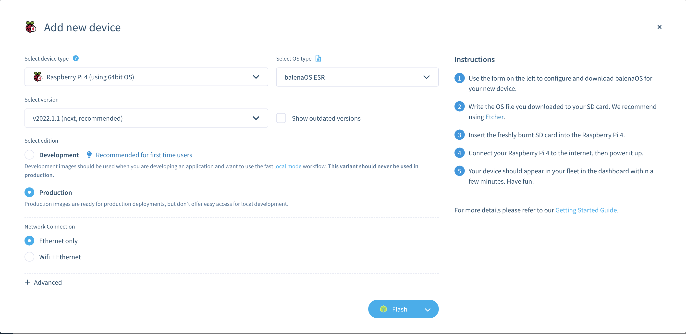
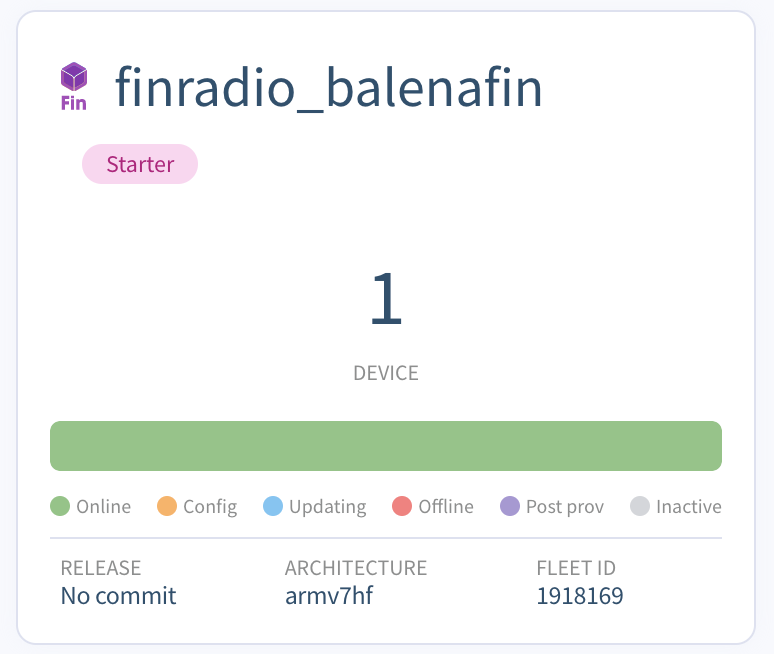

# finradio

With this app plus a Raspberry Pi and a [RTL-SDR](https://www.rtl-sdr.com/) compatible USB dongle you can build a Radio Receiver to listen to FM Radio.

This app is the software side of FinRadio, a radio tuner with rotary knobs used to change the tuning frequency and output volume, and a small display that shows the current frequency.

As a minimum you need a Raspberry Pi + a SDR (Software-Defined Radio) dongle, speakers, and a keyboar to use to to change the tuning frequency and output volume.

This project was done during the balenaLabs residency program. You can see more details in [the forum post I kept during the project](https://forums.balena.io/t/finradio-a-balenalabs-residency-project/354030/17)


## Components

The app is a multi-container balena app that uses:
 - 2 rotary-knob blocks to read from the volume and tuning knob
 - a containerized rtl_fm fork to listen to and control the radio tuner
 - a Node.js app that controls the other components and runs the display





Currently the apps uses a modified version of the `rtl_fm` program called `rtl_udp` that provides a very simple protocol over UDP to change the tuner frequency, and that we can extend to send extra commands if we need to.

The sound is played through the audio out.

The volume and tuning knobs are handled with a pair of [rotary-knob blocks](https://github.com/ramirogm/rotary-knob)

## Running the full version

Bill of materials ( note that the links I've added are from the devices I've tested, and as you'll see they're from local sellers in Argentina ):

* A SDR receiver. I use mainly a [NooElec NESDR SMArt HF Bundle](https://www.amazon.com/-/es/Nooelec-NESDR-Smart-HF-Bundle/dp/B0747PX3NZ/ref=sr_1_5?__mk_es_US=%C3%85M%C3%85%C5%BD%C3%95%C3%91&crid=HAFBTX414EUU&keywords=nooelec+nesdr+smart&qid=1647996086&sprefix=nooelec+nesdr+smart+hf+bundle%2Caps%2C227&sr=8-5&language=en_US). I also bought a [cheap USB dongle](https://articulo.mercadolibre.com.ar/MLA-797334923-receptor-sdr-chip-rtl2832u-r820t2-radioescucha-25mhz-a-2ghz-_JM?quantity=1) and it works perfectly. Note that if you plug this in you can't plug an Ethernet cable on a Pi as the sockets are too close - The [nooelecs](https://www.amazon.com/-/es/Nooelec-NESDR-Smart-v4-SDR/dp/B01HA642SW/ref=sr_1_4?__mk_es_US=%C3%85M%C3%85%C5%BD%C3%95%C3%91&crid=30THJ5CEUIBWD&keywords=SDR&qid=1647996075&refresh=1&sprefix=sdr%2Caps%2C248&sr=8-4) don't have this problem.
* 2 rotary knobs. I have a pair of [Ky-040](https://articulo.mercadolibre.com.ar/MLA-869711164-modulo-encoder-rotativo-ky-040-20-vueltas-arduino-unoelectro-_JM?quantity=2) rotary encoders.
* 2 Nicely looking knobs. [I got these in black](https://articulo.mercadolibre.com.ar/MLA-696351558-perilla-potenciometro-knob-15x17-dorada-negra-_JM?quantity=4)
* 2 LEDs, one yellow, one green
* 2 resistors to avoid blowing up the LEDs
* 1 SSD1306 controlled OLED 128x64 display. I got a beautiful [one that displays the top 20-something rows in yellow and the rest in a shiny blue](https://articulo.mercadolibre.com.ar/MLA-743257264-pantalla-oled-display-096p-arduino-raspberry-arm-i2c-iic-se-_JM?quantity=1). See options below if you want to use something different
* Some kind of speakers connected to the Audio jack on the Raspberry Pi. Don't forget to turn the speakers on!. [I bought this pair and they're small and sound ok](https://articulo.mercadolibre.com.ar/MLA-775450895-parlantes-pc-computadora-notebook-netbook-tablet-noga-ng-106-_JM?quantity=1&variation_id=47840885316) I also bought [a pair of Logitechs which are a little bigger](https://www.mercadolibre.com.ar/parlante-logitech-z120-negro-y-blanco/p/MLA15931818?pdp_filters=item_id:MLA910491293) but have fuller sound.

You also need a supported device:

<table>
  <tr>
    <td>
</td>
    <td> balenaFin</td>
    <td>You'd need to add an USB sound card to be able to play through an Audio Jack. Something like <a href="https://www.adafruit.com/product/1475">this sound board</a> or even one <a href="https://www.adafruit.com/product/3369">with speakers</a>. Note that I haven't tested any of these</td>
  </tr>
<tr><td>
</td><td>Raspberry Pi 3 Model B+</td>
    <td>Not tested</td>
</tr>
<tr><td>
</td><td>Raspberry Pi 4 Model B</td>
    <td>Tested</td>
</tr>
<tr><td>
</td><td>Raspberry Pi 400</td>
    <td>You'd need to add an USB sound card to be able to play through an Audio Jack</td>
</tr>
</table>


### Wiring

For the full version, you need to wire the components according to the following diagram. If you change the GPIO pins take note so that you can later update the config using fleet variables or directly on `docker-compose.yaml`.



## Running

### If you already have a fleet

You need to create a fleet on your balena account and push this app to it.

For example, if you already have a fleet named `bravo_fin_2`:

Let's push to the `bravo_fin_2` fleet

```shell
balena push bravo_fin_2
```

You'll see a looong log of docker building the image the first time; next ones most of it would be cached.

If you see a unicorn then we're good! And after a minute or two you should be listening to the radio on your Pi!


```
[Info]     Build finished in 3 minutes, 17 seconds
                            \
                             \
                              \\
                               \\
                                >\/7
                            _.-(6'  \
                           (=___._/` \
                                )  \ |
                               /   / |
                              /    > /
                             j    < _\
                         _.-' :      ``.
                         \ r=._\        `.
                        <`\\_  \         .`-.
                         \ r-7  `-. ._  ' .  `\
                          \`,      `-.`7  7)   )
                           \/         \|  \'  / `-._
                                      ||    .'
                                       \\  (
                                        >\  >
                                    ,.-' >.'
                                   <.'_.''
                                     <'
```

### Creating and deploying to a fleet

All you need to do is click the deploy button below:

[](https://dashboard.balena-cloud.com/deploy?repoUrl=https://github.com/ramirogm/finradio)

You will then be lead to creating a fleet in the balena dashboard. Choose `Raspberry Pi 3 or 4B` as the default device type and then click `advanced` to further detail the configuration of the fleet. Below there is a section that explains all of the variables you see in the advanced page. You can change these values later on if you want to create the fleet first and worry about the configuration later.





After deploying the fleet, you should see something like this:


Now, it's time to add your device(s) to the fleet. Press `add device` on the dashboard and then select how you want your device image to be configured. We suggest selecting the `development` edition for first time users so you can iterate and develop locally. Afterwards, connect your SD Card to your PC and press `flash` to flash the image.


Insert the newly flashed SD card to your device, turn it on, and you should see it in the dashboard in a few minutes.

If you're using a `balenaFin` you can flash directly from balena Etcher to the fin. Once you do that and after you reboot the device you'll see it added to the fleet 


## Hardware alternatives

If you only got the SDR or are missing some pieces here are some alternatives.

### No rotary knobs

If you want to run the FinRadio without rotary knobs, then you can use the keyboard to change the tuning frequency and the volume.

Key assignments:

| Key | Function |
|:---|:----|
| a | Tune down |
| d | Tune up |
| s | Volume down |
| w | Volume up |


You need to set the environment variables so that the app knows where to read the keypresses from.

To get the id, plugin the keyboard, connect a terminal to the `controller` container and run `lsusb`. Example:

```log
Connecting to 9cf53107314f3cb2e482e2594c710116...
Spawning shell...
root@bf3b12b834c4:/usr/src/app# lsusb
Bus 002 Device 001: ID 1d6b:0003 Linux Foundation 3.0 root hub
Bus 001 Device 006: ID 05ac:020b Apple, Inc. Pro Keyboard [Mitsumi, A1048/US layout]
Bus 001 Device 005: ID 05ac:1003 Apple, Inc. Hub in Pro Keyboard [Mitsumi, A1048]
Bus 001 Device 004: ID 0bda:2838 Realtek Semiconductor Corp. RTL2838 DVB-T
Bus 001 Device 003: ID 045e:0745 Microsoft Corp. Nano Transceiver v1.0 for Bluetooth
Bus 001 Device 002: ID 2109:3431 VIA Labs, Inc. Hub
Bus 001 Device 001: ID 1d6b:0002 Linux Foundation 2.0 root hub
root@0b469551c9b8:/usr/src/app# 
```

Then update the values of `VENDOR_ID` and `PRODUCT_ID` ; on this example we'd set:

```yaml
- VENDOR_ID=05ac
- PRODUCT_ID=020b
```      

root@0b469551c9b8:/usr/src/app# lsusb
Bus 001 Device 008: ID 0bda:2838 Realtek Semiconductor Corp. RTL2838 DVB-T
Bus 001 Device 007: ID 04d8:eed2 Microchip Technology, Inc. CTRL Keyboard
Bus 001 Device 006: ID 04d8:eec5 Microchip Technology, Inc. Massdrop Hub
Bus 001 Device 004: ID 0403:6010 Future Technology Devices International, Ltd FT2232C/D/H Dual UART/FIFO IC
Bus 001 Device 003: ID 0424:ec00 Microchip Technology, Inc. (formerly SMSC) SMSC9512/9514 Fast Ethernet Adapter
Bus 001 Device 002: ID 0424:9514 Microchip Technology, Inc. (formerly SMSC) SMC9514 Hub
Bus 001 Device 001: ID 1d6b:0002 Linux Foundation 2.0 root hub


### No LED feedback pins

Nothing will break. Just be sure that the output pins are not connected to anything that may break!

## Usage and Customization

### List of all environment variables

To edit these values in the dashboard, simply press `Variables` on the left column.


| Env Var | Description | Default |
|:---|:----|:---|
| RADIO_ENABLED| Run the radio demodulator. Disable if you don't have a tuner and want to try the other features like turning the volume knob, or are just testing | 1 |
| GREEN_GPIO_PIN|  GPIO pin # where the Green Led is connected to | 6 |
| YELLOW_GPIO_PIN |  GPIO pin # where the Green Led is connected to |26 |
| INITIAL_FREQUENCY_MHZ|  Initial tuner frequency, in Mhz| 101.9 |
| DISPLAY_TYPE | Must be I2C or NONE | I2C |


### Environment variables that have to be changed through docker-compose

If you want to change the Tuning and Volume rotary knob pinouts, the you'd need to edit the `docker-compose.yaml`

Why is this? The app uses two instances of the `rotary knob` block and currently there's no way two map two different fleet variables to the same variable name, one on each container.

# Credits

- A key component of the app is the [rtl_fm](http://kmkeen.com/rtl-demod-guide/) program that is included in the rtl-sdr package. I'm actually using a fork that called [rtl_udp](./../sysrun__rtl-sdr/README.md): _rtl_udp is a copy of rtl_fm with a special feature: It opens a udp control port (currently fixed to 6020) which takes commands like changing the frequency or mode. No need to restart :)_

- References! While looking for ideas and references for my project I found or was told about these excellent related projects:

  * SDR: An spectrum visualization https://hub.balena.io/gh_jaomaloy/balena-rtl-power by Jao Maloloy-on `@jaomaloy`

  * A flight traffic app on Hub here: https://hub.balena.io/ketil/balena-ads-b

  * A Pi **transmitter** Cool if you want to broadcast FM from an audio source! https://hub.balena.io/grokbeer/rickroll-fm https://github.com/grokbeer/rickroll-fm

  * Alan Boris @alab128 did a great project that allows you to use OpenWebRX to listen to some frequencies and visualize the radio spectrum, packed as a balena app https://www.balena.io/blog/running-openwebrx-on-balena-to-remotely-monitor-local-radio-spectrum/

  * WAT!! A "Sound cabinet" https://balenaltd.io/rosswesleyporter/blog/make-the-extra-small-model/ This is excellent and beautiful, a cabinet where we can put the Pi. I could use this or an old radio. Or make two and use both!.


